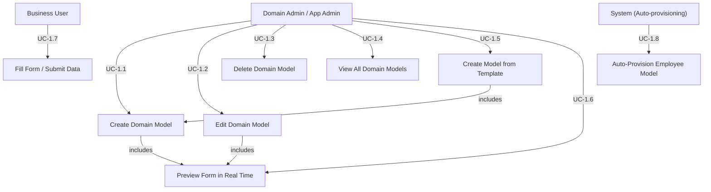
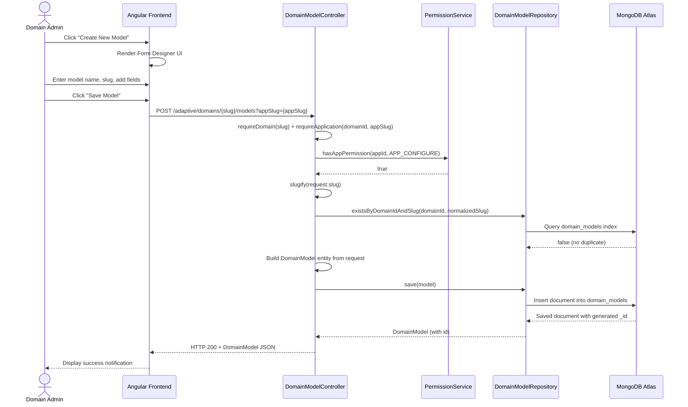
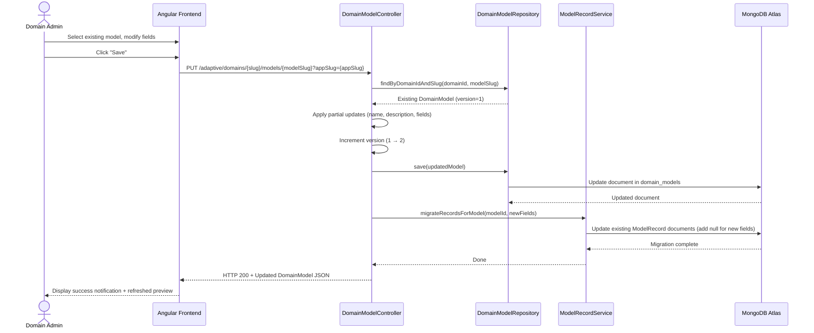
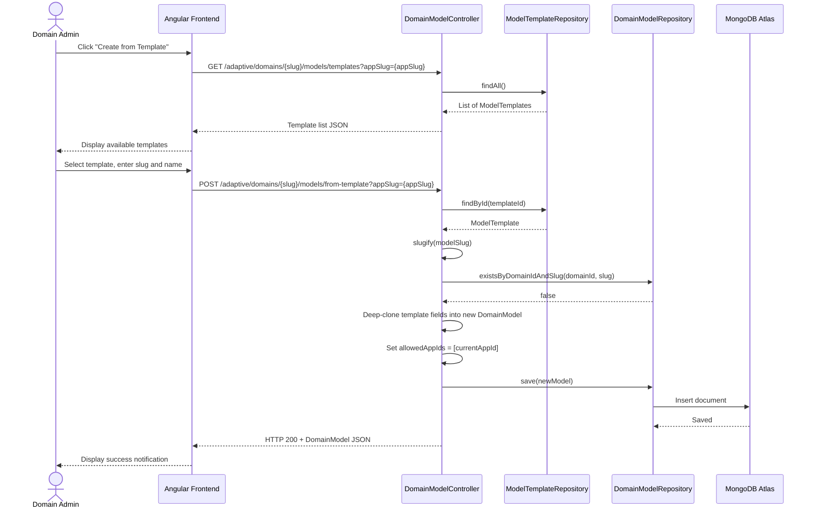

# Functionality Requirements

---

## Functionality 1

### Dynamic Domain Model (Form) Builder

### Description and Priority

This feature provides a graphical, low-code interface for administrators to dynamically define custom data schemas (DomainModel). Instead of writing SQL tables or backend code, users can drag and drop field components (DomainModelField) to build data entry forms. These custom schemas act as the foundational data structures utilized by the application's Workflow and Process engines. Priority: High (Benefit: 9, Penalty: 9, Cost: 5, Risk: 6). This is the core engine of the platform; without data models, no workflows or independent data collections can exist.

### Stimulus/Response Sequences

Stimulus: The Domain Admin navigates to the App Models page and clicks the "Create New Model" button.
Response: The system renders the Form Designer interface with an empty model canvas, field palette, and live preview panel.

Stimulus: The user configures a new DomainModelField (e.g., adding a "Date of Birth" field and setting its type to DATE).
Response: The system updates the live form preview and appends the new field configuration to the pending JSON schema payload.

Stimulus: The user clicks "Save Model".
Response: The system API validates field uniqueness, sanitizes identifiers (fieldSlug), persists the DomainModel document to the MongoDB database, and returns a success notification.

Stimulus: The user selects an existing model from the model list and modifies its fields.
Response: The system increments the model version, persists the changes, and automatically migrates existing records by null-filling any newly added fields.

Stimulus: The user selects "Create from Template" and chooses a pre-built template (e.g., Employee Directory).
Response: The system deep-clones the template's field definitions into a new DomainModel, assigns it to the current domain and application, and persists it.

### Functional Requirements / User Stories

REQ-1: The system must allow users with the APP_CONFIGURE permission (granted via App Groups to Domain Admins and App Admins) to create, read, update, and delete (CRUD) DomainModel entities within a designated Application.
REQ-2: The system must support at least the following dynamic DomainFieldType options: STRING, NUMBER, BOOLEAN, DATE, DATETIME, REFERENCE, EMPLOYEE_REFERENCE, OBJECT, and ARRAY.
REQ-3: The system must enforce validation to ensure that all field identifiers (key) within a single DomainModel are strictly unique to prevent data collision.
REQ-4: The system must serialize and store the generated forms flexibly within the NoSQL document database (MongoDB) to support arbitrary field additions without requiring database migrations.
REQ-5: The system must enforce a unique compound index on {domainId, slug} to prevent duplicate model slugs within the same domain.
REQ-6: The system must sanitize all model slug identifiers via a slugify() function (lowercase, replace non-alphanumeric with hyphens, trim leading/trailing hyphens).
REQ-7: The system must auto-increment the model version when fields are updated and trigger automatic record migration (null-fill for new fields) via ModelRecordService.
REQ-8: The system must support Model Templates: pre-configured model definitions that can be listed and instantiated into new DomainModel entities with deep-cloned fields.
REQ-9: The system must support model visibility scoping via sharedWithAllApps (boolean) and allowedAppIds (set of application IDs).
REQ-10: The system must auto-provision a built-in Employee model (slug: employees, scope: SYSTEM_WIDE, isSystemModel: true) when a new Organisation is created.

### User Stories


User story ID: US-01
User Role: Domain Admin / App Admin
Description: As a Domain Admin, I want to create a new Domain Model by providing a name, slug, and description so that I can define a custom data schema for my application.
Acceptance Criteria:
- The "Create New Model" button is visible only to users with APP_CONFIGURE permission.
- The system validates that name and slug are not blank.
- The system rejects duplicate slugs within the same domain with HTTP 409 Conflict.
- On success, the model is persisted and the user sees a success notification.
Supporting Information/Reference: CreateDomainModelRequest DTO with @NotBlank on name and slug fields.
Output: A new DomainModel document persisted in the domain_models MongoDB collection with version = 1.
Dependencies: Organisation exists, Application exists, User authenticated with APP_CONFIGURE permission.
Integration: DomainModelController.create(), DomainService.createDomainModel()


User story ID: US-02
User Role: Domain Admin / App Admin
Description: As a Domain Admin, I want to add fields (with types like STRING, NUMBER, DATE, BOOLEAN, etc.) to my Domain Model so that I can structure the data my application will collect.
Acceptance Criteria:
- Each field requires a unique key (not blank) and a valid DomainFieldType.
- Fields can be marked as required and/or unique.
- A flexible config map can store type-specific metadata (e.g., select options, regex patterns).
- The live preview updates immediately after adding each field.
Supporting Information/Reference: DomainModelField entity with @NotBlank key, @NotNull type, and Map<String, Object> config.
Output: Field appended to the model's fields array; live preview re-renders via the <render-form> component.
Dependencies: US-01 (Model must exist or be in creation).
Integration: ModelPageComponent.addFieldToForm(), DomainModelField, FIELD_TYPES constant


User story ID: US-03
User Role: Domain Admin / App Admin
Description: As a Domain Admin, I want to edit an existing Domain Model (modify name, description, or fields) so that I can evolve my data schema as business requirements change.
Acceptance Criteria:
- Only users with APP_CONFIGURE permission can edit.
- When fields are modified, the model version auto-increments.
- Existing records are migrated: new fields receive null values.
- Partial updates are supported (only provided fields are changed).
Supporting Information/Reference: UpdateDomainModelRequest DTO with all optional fields; ModelRecordService.migrateRecordsForModel().
Output: Updated DomainModel with incremented version; existing model records null-filled for new fields.
Dependencies: US-01 (Model exists).
Integration: DomainModelController.update(), ModelRecordService.migrateRecordsForModel()


User story ID: US-04
User Role: Domain Admin / App Admin
Description: As a Domain Admin, I want to delete a Domain Model that is no longer needed so that I can keep my application workspace clean.
Acceptance Criteria:
- Only users with APP_CONFIGURE permission can delete.
- The system returns HTTP 204 No Content on success.
- If the model slug does not exist, HTTP 404 is returned.
Supporting Information/Reference: DomainModelController.delete()
Output: DomainModel document permanently removed from the domain_models collection.
Dependencies: US-01 (Model exists).
Integration: DomainModelController.delete(), DomainService.deleteDomainModel()


User story ID: US-05
User Role: Domain Admin / App Admin
Description: As a Domain Admin, I want to view a list of all Domain Models within my application so that I can manage and select models for editing or workflow integration.
Acceptance Criteria:
- The list displays model name, slug, version, field count, and timestamps.
- Only models belonging to the current domain are shown.
- The list is accessible only to users with APP_CONFIGURE permission.
Supporting Information/Reference: DomainModelController.list() endpoint returning List<DomainModel>.
Output: List of all DomainModel documents for the current domain.
Dependencies: US-01 (At least one model exists).
Integration: DomainModelController.list(), DomainService.getDomainModels()


User story ID: US-06
User Role: Domain Admin / App Admin
Description: As a Domain Admin, I want to create a new model from a pre-built template so that I can quickly set up standard data structures without defining fields from scratch.
Acceptance Criteria:
- Available templates are listed from the ModelTemplate collection (e.g., Employee Directory, Project Tracker, Asset Inventory, Vendor Management).
- User provides a templateId, modelSlug, and modelName.
- Fields are deep-cloned from the template including config maps.
- The new model is scoped to the current app (allowedAppIds contains the current app ID).
- Duplicate slug detection returns HTTP 409.
Supporting Information/Reference: ModelTemplateSeeder seeds default templates; DomainModelController.createFromTemplate().
Output: New DomainModel with deep-cloned template fields persisted in domain_models collection.
Dependencies: US-01, Templates seeded by ModelTemplateSeeder.
Integration: DomainModelController.createFromTemplate(), DomainService.createModelFromTemplate()


User story ID: US-07
User Role: Domain Admin / App Admin
Description: As a Domain Admin, I want to see a live preview of my form as I add and configure fields so that I can validate the user experience before saving.
Acceptance Criteria:
- The preview panel renders all added fields with correct input types (text, number, select, radio, checkbox, date, etc.).
- Select/Radio/Checkbox fields show their configured options.
- The preview updates instantly without page reload.
Supporting Information/Reference: <render-form> Angular component bound to the model's fields array.
Output: Real-time WYSIWYG form preview in the right panel of the Form Designer.
Dependencies: US-02 (At least one field added).
Integration: model-page.component.html, <render-form> component


### Use Case Diagram




Use Case ID: 1.1
Use Case Name: Create Domain Model
Created By: AdaptiveBP Team
Last Updated By: AdaptiveBP Team
Date Created: 2026-04-14
Date Last Updated: 2026-04-14

Actors: Domain Admin, App Admin
Description: This use case describes how an administrator creates a new data schema (DomainModel) within an application. The model defines the field structure for data entry forms and serves as the foundation for workflows and processes.
Preconditions:
1. User is authenticated with a valid JWT token.
2. User has APP_CONFIGURE permission in the target application.
3. The target Organisation and Application exist.
Postconditions:
1. A new DomainModel document is persisted in the domain_models MongoDB collection.
2. The model is assigned to the domain with a unique, sanitized slug.
3. The model appears in the application's model list.
Normal Course:
1. User navigates to the App Models page (/domain/:slug/app/:appSlug/models).
2. User clicks "Create New Model".
3. System renders the Form Designer interface.
4. User enters Model Name and Model Slug.
5. User optionally adds a description.
6. User adds fields using the field palette (see UC-1.6).
7. User configures app sharing settings (shared with all apps or specific apps).
8. User clicks "Save Model".
9. System calls POST /adaptive/domains/{slug}/models?appSlug={appSlug}.
10. System validates: name/slug not blank, slug is unique within domain.
11. System sanitizes the slug via slugify().
12. System persists the DomainModel document to MongoDB.
13. System returns HTTP 200 with the saved model JSON.
14. Frontend displays success notification.
Alternative Courses:
1.1.AC.1 — Create from Template: User selects "Create from Template" instead of creating from scratch. System lists available ModelTemplate entries. User selects a template, provides slug and name. System deep-clones template fields into a new model. (See UC-1.5)
Exceptions:
1.1.EX.1 — Duplicate Slug: If the slug already exists within the domain, the system returns HTTP 409 Conflict with message "Model slug already exists".
1.1.EX.2 — Missing Permission: If the user lacks APP_CONFIGURE permission, the system returns HTTP 403 Forbidden.
1.1.EX.3 — Validation Failure: If name or slug is blank, the system returns HTTP 400 Bad Request.
1.1.EX.4 — Domain/App Not Found: If the domain slug or app slug is invalid, the system returns HTTP 404 Not Found.
Includes: UC-1.6 (Preview Form in Real Time)
Priority: High
Frequency of Use: 2–10 times per week per organisation during initial setup; infrequent after stabilization.
Business Rules:
- Model slugs must be globally unique within a domain.
- Slugs are auto-sanitized (lowercase, alphanumeric + hyphens only).
- New models default to version = 1 and scope = DOMAIN_SCOPED.
Special Requirements: Response time < 2 seconds for model creation. Form Designer must work on modern browsers (Chrome, Firefox, Edge).
Assumptions: The user has already created an Organisation and at least one Application.
Notes and Issues: The legacy /custom_form/model/create endpoint still exists but is planned for deprecation. New implementations should use /adaptive/domains/{slug}/models.


Use Case ID: 1.2
Use Case Name: Edit Domain Model
Created By: AdaptiveBP Team
Last Updated By: AdaptiveBP Team
Date Created: 2026-04-14
Date Last Updated: 2026-04-14

Actors: Domain Admin, App Admin
Description: This use case describes how an administrator modifies an existing DomainModel — updating its name, description, sharing settings, or field definitions — with automatic version management and record migration.
Preconditions:
1. User is authenticated with APP_CONFIGURE permission.
2. The target DomainModel exists in the domain.
Postconditions:
1. The DomainModel document is updated in MongoDB.
2. If fields were modified, the model version is incremented by 1.
3. Existing data records are migrated — new fields receive null values.
Normal Course:
1. User navigates to the model list and selects an existing model.
2. System loads the model configuration into the Form Designer, populating all fields, types, and validation rules.
3. User modifies name, description, and/or fields.
4. User clicks "Save".
5. System calls PUT /adaptive/domains/{slug}/models/{modelSlug}?appSlug={appSlug}.
6. System applies partial updates (only non-null request fields are changed).
7. If fields changed: version increments, ModelRecordService.migrateRecordsForModel() is called.
8. System returns HTTP 200 with the updated model.
9. Frontend displays success notification.
Alternative Courses:
1.2.AC.1 — Update Metadata Only: User changes only name or description without touching fields. Version does not increment; no record migration occurs.
Exceptions:
1.2.EX.1 — Model Not Found: HTTP 404 if the model slug does not exist.
1.2.EX.2 — Permission Denied: HTTP 403 if user lacks APP_CONFIGURE.
Includes: UC-1.6 (Preview Form in Real Time)
Priority: High
Frequency of Use: 1–5 times per week during active development.
Business Rules:
- Field modifications trigger automatic version increment.
- Record migration is automatic and non-destructive (null-fill only).
Special Requirements: None
Assumptions: The model has no active workflow instances that would be broken by field changes.
Notes and Issues: None


Use Case ID: 1.3
Use Case Name: Delete Domain Model
Created By: AdaptiveBP Team
Last Updated By: AdaptiveBP Team
Date Created: 2026-04-14
Date Last Updated: 2026-04-14

Actors: Domain Admin, App Admin
Description: This use case describes how an administrator permanently removes a DomainModel from the system.
Preconditions:
1. User is authenticated with APP_CONFIGURE permission.
2. The target model exists and is not a system model (isSystemModel = false).
Postconditions:
1. The DomainModel document is removed from the domain_models collection.
2. The model no longer appears in the model list.
Normal Course:
1. User navigates to model list.
2. User clicks "Delete" on the target model.
3. System prompts for confirmation.
4. User confirms deletion.
5. System calls DELETE /adaptive/domains/{slug}/models/{modelSlug}?appSlug={appSlug}.
6. System removes the document from MongoDB.
7. System returns HTTP 204 No Content.
8. Frontend refreshes the model list.
Alternative Courses: None
Exceptions:
1.3.EX.1 — Model Not Found: HTTP 404 if the model slug does not exist.
1.3.EX.2 — Permission Denied: HTTP 403 if user lacks APP_CONFIGURE.
Includes: None
Priority: Medium
Frequency of Use: Rarely — during cleanup or restructuring.
Business Rules: System models (isSystemModel = true) should not be deletable by regular admins.
Special Requirements: None
Assumptions: No active workflow instances reference this model.
Notes and Issues: Associated model records (ModelRecord documents) are not cascade-deleted. This is a known limitation to be addressed in a future iteration.


Use Case ID: 1.4
Use Case Name: View All Domain Models
Created By: AdaptiveBP Team
Last Updated By: AdaptiveBP Team
Date Created: 2026-04-14
Date Last Updated: 2026-04-14

Actors: Domain Admin, App Admin
Description: This use case describes how an administrator views the complete list of DomainModels within their domain for management purposes.
Preconditions:
1. User is authenticated with APP_CONFIGURE permission.
2. At least one DomainModel exists in the domain.
Postconditions: The model list is displayed to the user.
Normal Course:
1. User navigates to /domain/:slug/app/:appSlug/models.
2. System calls GET /adaptive/domains/{slug}/models?appSlug={appSlug}.
3. System returns all models for the domain as a JSON array.
4. Frontend renders the model list with name, slug, version, field count, and timestamps.
Alternative Courses: None
Exceptions:
1.4.EX.1 — Permission Denied: HTTP 403 if user lacks APP_CONFIGURE.
Includes: None
Priority: High
Frequency of Use: Multiple times per session.
Business Rules: All domain-level models are returned regardless of app-level sharing settings.
Special Requirements: None
Assumptions: None
Notes and Issues: None


Use Case ID: 1.5
Use Case Name: Create Model from Template
Created By: AdaptiveBP Team
Last Updated By: AdaptiveBP Team
Date Created: 2026-04-14
Date Last Updated: 2026-04-14

Actors: Domain Admin, App Admin
Description: This use case describes how an administrator creates a new DomainModel by selecting a pre-built template (e.g., Employee Directory, Project Tracker, Asset Inventory, Vendor Management) instead of building from scratch.
Preconditions:
1. User has APP_CONFIGURE permission.
2. At least one ModelTemplate exists in the system (seeded by ModelTemplateSeeder).
Postconditions: A new DomainModel is created with deep-cloned fields from the template, scoped to the current app.
Normal Course:
1. User clicks "Create from Template" on the Models page.
2. System calls GET /adaptive/domains/{slug}/models/templates?appSlug={appSlug}.
3. System displays available templates with names and field counts.
4. User selects a template and provides a custom modelSlug and modelName.
5. System calls POST /adaptive/domains/{slug}/models/from-template?appSlug={appSlug}.
6. System validates: templateId exists, slug is unique within domain.
7. System deep-clones template fields (including config maps) into a new DomainModel.
8. System sets allowedAppIds to contain the current app's ID.
9. System persists and returns the new model.
10. Frontend displays success notification.
Alternative Courses: None
Exceptions:
1.5.EX.1 — Template Not Found: HTTP 404 if templateId does not exist.
1.5.EX.2 — Duplicate Slug: HTTP 409 if the modelSlug already exists in the domain.
1.5.EX.3 — Missing Fields: HTTP 400 if templateId, modelSlug, or modelName is null.
Includes: UC-1.1 (Create Domain Model)
Priority: Medium
Frequency of Use: 1–3 times during initial application setup.
Business Rules: Template fields are deep-cloned so modifications to the new model do not affect the original template.
Special Requirements: None
Assumptions: Templates have been seeded into the ModelTemplate collection at system startup.
Notes and Issues: None


Use Case ID: 1.6
Use Case Name: Preview Form in Real Time
Created By: AdaptiveBP Team
Last Updated By: AdaptiveBP Team
Date Created: 2026-04-14
Date Last Updated: 2026-04-14

Actors: Domain Admin, App Admin
Description: As fields are added or modified in the Form Designer, the system renders a live WYSIWYG preview of the resulting data entry form, allowing the administrator to validate the user experience before saving.
Preconditions: The Form Designer is open (via UC-1.1 or UC-1.2).
Postconditions: The preview reflects all currently configured fields with correct input types.
Normal Course:
1. User adds or modifies a field in the left panel.
2. The <render-form> Angular component re-renders in the right panel.
3. Each field is displayed with its configured input type (text, number, date, select dropdown, radio, checkbox, etc.).
4. Select/Radio/Checkbox fields display their configured options.
5. User visually validates the form layout and field configurations.
Alternative Courses: None
Exceptions: None
Includes: None
Priority: High
Frequency of Use: Continuous during model creation/editing sessions.
Business Rules: Preview is client-side only and does not trigger API calls.
Special Requirements: Must render without page reload using Angular two-way data binding.
Assumptions: None
Notes and Issues: None


Use Case ID: 1.7
Use Case Name: Fill Form and Submit Data
Created By: AdaptiveBP Team
Last Updated By: AdaptiveBP Team
Date Created: 2026-04-14
Date Last Updated: 2026-04-14

Actors: Business User
Description: An end user fills out a data entry form generated from a DomainModel and submits the data for persistence.
Preconditions:
1. User is authenticated.
2. A DomainModel exists and is accessible by the user's application.
3. User has appropriate app-level permissions.
Postconditions:
1. A new ModelRecord document is persisted in the model's dynamic collection.
2. Data values are validated against field types and constraints.
Normal Course:
1. User navigates to the data entry form for a specific model.
2. System renders the form based on the DomainModel's field definitions.
3. User fills in field values.
4. User clicks "Submit".
5. System validates each field value against its DomainFieldType using matchesType().
6. System creates a ModelRecord and persists it via ModelRecordService.
7. System returns success confirmation.
Alternative Courses: None
Exceptions:
1.7.EX.1 — Type Mismatch: If a field value does not match its DomainFieldType, the system rejects with a validation error.
1.7.EX.2 — Required Field Missing: If a required field is empty, submission is blocked.
Includes: None
Priority: High
Frequency of Use: Multiple times daily by Business Users.
Business Rules: Field values must conform to the model's DomainFieldType definitions.
Special Requirements: None
Assumptions: None
Notes and Issues: None


Use Case ID: 1.8
Use Case Name: Auto-Provision Employee Model
Created By: AdaptiveBP Team
Last Updated By: AdaptiveBP Team
Date Created: 2026-04-14
Date Last Updated: 2026-04-14

Actors: System (automated)
Description: When a new Organisation is created, the system automatically provisions a built-in Employee model with standard HR fields. This is a system-triggered use case with no direct user interaction.
Preconditions: A new Organisation is being created via DomainProvisioningService.
Postconditions:
1. An "Employees" DomainModel (slug: employees) is created with fields: Employee ID, First Name, Last Name, Email, Department, Position, Hire Date, Status.
2. The model is marked isSystemModel = true and scope = SYSTEM_WIDE.
Normal Course:
1. Owner creates a new Organisation (triggers UC-3.1).
2. DomainProvisioningService.provisionDefaults() is invoked.
3. System checks if an "employees" model already exists for the domain.
4. If not, system creates the Employee model with 8 default fields.
5. System persists the model to the domain_models collection.
Alternative Courses:
1.8.AC.1 — Model Already Exists: If an "employees" model already exists for the domain (e.g., from a previous provisioning attempt), the system skips creation to avoid duplicates.
Exceptions: None
Includes: None
Priority: Medium
Frequency of Use: Once per Organisation creation.
Business Rules: Employee records are managed exclusively via domain access assignments; manual CRUD via the model endpoint returns HTTP 405 Method Not Allowed.
Special Requirements: None
Assumptions: None
Notes and Issues: None


### Sequence Diagram

#### SD-1: Create Domain Model



#### SD-2: Edit Domain Model (with Field Migration)



#### SD-3: Create Model from Template



### System Mock-up Screens

#### Screen 1: App Models List Page

```
┌─────────────────────────────────────────────────────────────────┐
│  NAVBAR  [Logo] AdaptiveBP    [Domain: acme-corp]   [User ▾]   │
├─────────────────────────────────────────────────────────────────┤
│                                                                 │
│  ◄ Back to App: Inventory                                       │
│                                                                 │
│  ┌─────────────────────────────────────────────────────────┐    │
│  │  📋 Domain Models                  [+ Create New Model]  │   │
│  │                                    [📦 From Template]    │   │
│  ├──────────┬──────────┬─────┬────────┬──────────┬─────────┤   │
│  │ Name     │ Slug     │ Ver │ Fields │ Updated  │ Actions │   │
│  ├──────────┼──────────┼─────┼────────┼──────────┼─────────┤   │
│  │ Employees│ employees│ v1  │ 8      │ 2026-04… │ 🔒 System│  │
│  │ Products │ products │ v3  │ 12     │ 2026-04… │ ✏️ 🗑️    │   │
│  │ Orders   │ orders   │ v1  │ 6      │ 2026-04… │ ✏️ 🗑️    │   │
│  │ Vendors  │ vendors  │ v2  │ 9      │ 2026-04… │ ✏️ 🗑️    │   │
│  └──────────┴──────────┴─────┴────────┴──────────┴─────────┘   │
│                                                                 │
└─────────────────────────────────────────────────────────────────┘
```

#### Screen 2: Form Designer (Create/Edit Model)

```
┌─────────────────────────────────────────────────────────────────┐
│  NAVBAR  [Logo] AdaptiveBP    [Domain: acme-corp]   [User ▾]   │
├─────────────────────────────────────────────────────────────────┤
│  ◄ Back to Models                                               │
│                                                                 │
│  ┌─────── Model Details ────────┐  ┌──── Live Preview ────────┐│
│  │ Model Name: [Products      ] │  │                           ││
│  │ Model Slug: [products       ]│  │  ── Products (v3) ──     ││
│  │ Description:[Inventory items]│  │                           ││
│  │                              │  │  Product Name:  [_______] ││
│  │ ── New Field ──              │  │  SKU:           [_______] ││
│  │ Field Name: [price         ] │  │  Category:      [▾ Pick ] ││
│  │ Field Type: [▾ NUMBER      ] │  │  Price:         [0.00   ] ││
│  │ ☐ Required  ☐ Unique        │  │  In Stock:      ☐         ││
│  │ Placeholder:[Enter price   ] │  │  Expiry Date:   [📅     ] ││
│  │ Default Val:[              ] │  │  Description:   [_______] ││
│  │                              │  │                  [_______] ││
│  │ ── Validation (Regex) ──     │  │                           ││
│  │ Pattern:    [              ] │  │  [      Save Model      ] ││
│  │ Error Msg:  [              ] │  │                           ││
│  │                              │  └───────────────────────────┘│
│  │  [  Add to Form  ]          │                                │
│  │                              │                                │
│  │ ── Sharing ──                │                                │
│  │ ○ This App Only              │                                │
│  │ ○ Shared with All Apps       │                                │
│  └──────────────────────────────┘                                │
└──────────────────────────────────────────────────────────────────┘
```

#### Screen 3: Template Selection Dialog

```
┌───────────────────────────────────────────────┐
│  📦 Create Model from Template                │
│                                               │
│  Select a template:                           │
│  ┌─────────────────────────────────────────┐  │
│  │ 👥 Employee Directory                    │  │
│  │    Standard HR fields (8 fields)        │  │
│  ├─────────────────────────────────────────┤  │
│  │ 📊 Project Tracker                      │  │
│  │    Project management fields (9 fields) │  │
│  ├─────────────────────────────────────────┤  │
│  │ 🏗️ Asset Inventory                      │  │
│  │    Asset tracking fields (10 fields)    │  │
│  ├─────────────────────────────────────────┤  │
│  │ 🤝 Vendor Management                    │  │
│  │    Vendor contact fields (8 fields)     │  │
│  └─────────────────────────────────────────┘  │
│                                               │
│  Model Name: [___________________________]    │
│  Model Slug: [___________________________]    │
│                                               │
│       [ Cancel ]       [ Create Model ]       │
└───────────────────────────────────────────────┘
```

---

## Functionality 2 (User Identity & Authentication)

*To be completed*

## Functionality 3 (Organisation & Application Management)

*To be completed*

## Functionality 4 (Workflow & Process Engine)

*To be completed*
